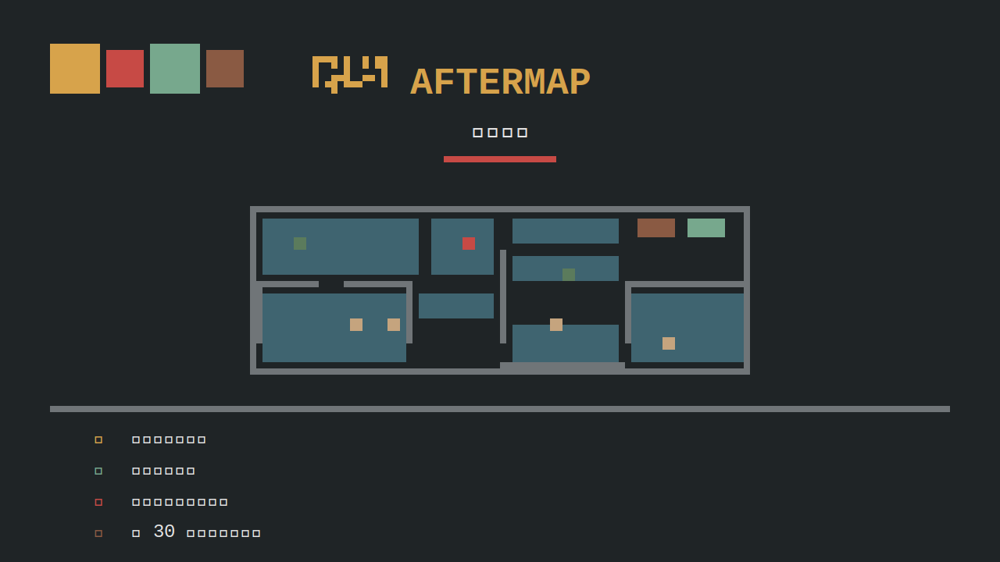
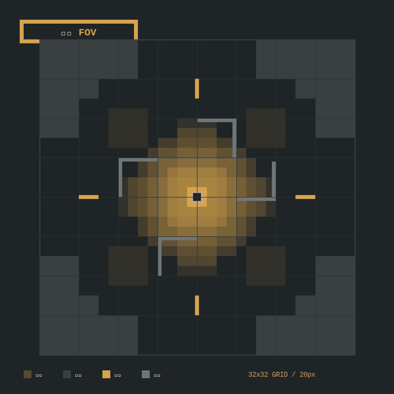
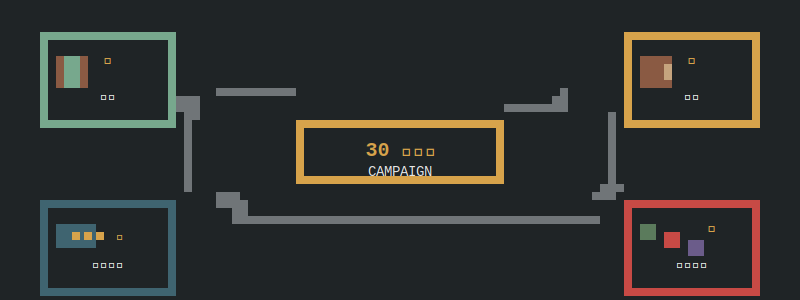
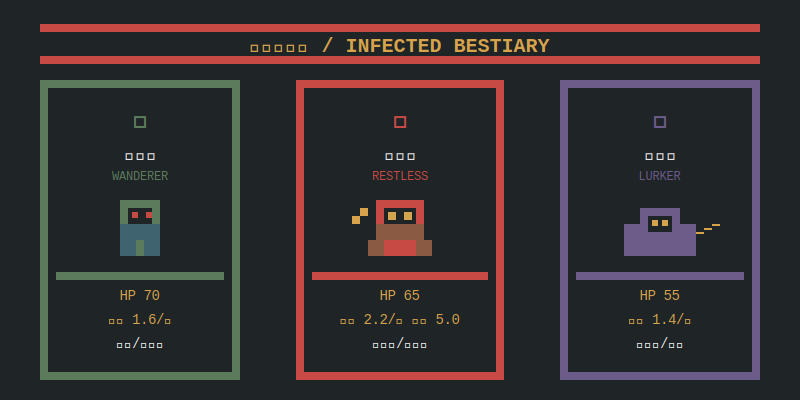
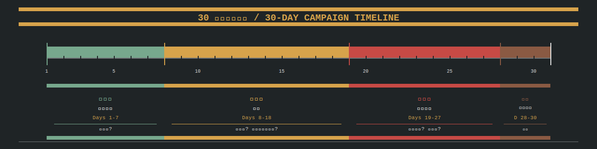

# 🏠 Aftermap 末日坐标 🗺️

[](https://github.com/zymalpha/aftermap/actions)
[](https://github.com/zymalpha/aftermap)
[](https://github.com/zymalpha/aftermap/releases)
[](LICENSE)
[](CONTRIBUTING.md)
[](https://github.com/zymalpha/aftermap)

> 🎮 一款以**真实城市街区为蓝本**的 2D 像素末日生存经营游戏。
> ⚔️ 回合制潜行 · 🏕️ 基地经营 · 🗺️ 程序生成迁徙 · 🧟 感染者生态。

---

## 🌟 中文 Hero

> 🏚️ **核灾后的第七天。**
> 城市的电力早已熄灭，街区成了僵尸、拾荒者与流民的角斗场。
> 你从避难所的废墟中爬出来，捡起一支生锈的撬棍——这是一张**手绘的街区地图**，
> 每个节点都是一处抉择：**潜入、搜刮、战斗、迁徙**。

**核心一句话循环**：
> 🗺️ **在真实街区上做回合制战术 → 🏕️ 回基地分配幸存者与资源 → 📖 触发事件推进 30 天叙事 → 💾 原子存档自动接力**

---

## ✨ 特性

| | 特性 | 一句话 |
|---|---|---|
| 🗺️ | **程序生成现实地图** | 把真实城市街区解析成战术网格（OSM 管线，ADR-0006） |
| ⚔️ | **回合制潜行 + 战斗** | 视线 / 视野 / 警戒值 / 感染四态，战术维度的"看到 vs 被看到" |
| 🏕️ | **基地 + 幸存者** | 30+ 设施、关系系统、班次轮换，长期经营而不只是单场战斗 |
| 🧟 | **感染生态** | 感染态、变异、抗体；不是"看见就打"，是"看见了也未必打得过" |
| 📦 | **白名单事件 + 内容驱动** | JSON 写剧情，校验器管 schema，解释器管沙箱（ADR-0005） |
| 💾 | **原子存档 + SHA-256** | 跨回合不丢档；崩溃后 `.bak` 自动回滚（ADR-0004） |

---

## 🚀 快速开始（30 分钟上手）

### 1️⃣ 前置环境（5 min）

- **Python 3.9+** — 跑内容 schema 校验。
- **Godot 4.6.2 (stable)** — win64 / linux / macos 任选；放到 `.tools/godot/Godot_v4.6.2-stable_win64.exe` 或保证 `godot` 在 `PATH`。
- 一个 POSIX shell（`bash`）或 Windows `cmd`。

> 💡 没有 Godot 也能跑：Python 校验器独立运行，Godot 缺失会优雅 WARN 退出 0。

### 2️⃣ 克隆（2 min）

```bash
git clone https://github.com/zymalpha/aftermap.git
cd aftermap
```

### 3️⃣ 跑通 spike（3 min）

**Windows**：

```bat
run.bat
REM 或：
tools\build\run_tests.bat
```

**Linux / macOS / WSL**：

```bash
bash run.sh
# 或：
bash tools/build/run_tests.sh
```

成功尾部（v1.0，497 PASS / 0 FAIL，含两道 P6 压力门）：

```
=== test_p4_thirty_days result: pass=2 fail=0 ===
=== test_p5_ui_layout result: pass=141 fail=0 ===
=== test_p6_thousand_seeds result: pass=2 fail=0 ===
=== summary: 1000 / 1000 seeds completed 30 days ===
=== test_p6_perf_benchmark result: pass=2 fail=0 ===
  PASS  avg frame 10.0 ms < 16.67 ms (60fps)
  PASS  p99 frame 15.0 ms < 33.00 ms (sustained 30fps)
=== 完成 ===
```

### 4️⃣ 阅读文档（15 min）

| 文档 | 它能告诉你什么 |
|---|---|
| `docs/production/PROJECT_STATE.md` | 当前 spike 状态、已知风险、硬约束、交付物 |
| `docs/production/BACKLOG.md` | P2–P6 路��图卡片 |
| `docs/production/DECISIONS.md` | ADR 索引（0001–0006） |
| `docs/production/CHANGELOG_DEV.md` | Stage 1–6 交付日志 |
| `docs/api/game-session.md` | `GameSession` API 契约 |
| `docs/api/tactical-session.md` | 战术网格 / 寻路 / FOV / 战斗 API |
| `docs/api/content-db.md` | Content DB 契约 |
| `docs/adr/0001..0006-*.md` | 架构决策记录 |
| `README_ORIG_PLANNING.md/` | 完整策划案（设计源头） |

### 5️⃣ 编辑一个事件（5 min）

打开 `content/events/sample_first_night.json`，把 `weight` 从 `60` 改成 `55`，重跑 `bash run.sh`。
Python 校验器会抓到任何 shape 错误；spike 不会因为这个字段失效。

---

## 🖼️ 游戏截图

> 暂无真实截图，下方为矢量占位图，PR 欢迎替换。

| 视图 | 描述 |
|---|---|
| 🎯 Hero 主视觉 |  |
| 🔲 战术网格 + FOV |  |
| 🔁 核心循环 |  |
| 🧟 感染者三态 |  |
| 📅 30 天战役时间线 |  |

---

## 🛣️ 路线图

| 阶段 | 状态 | 内容 |
|---|---|---|
| **P0** ✅ | 完成 | RNG 命名流、原子存档、事件解释器、命令队列 |
| **P1** ✅ | 完成 | 战术网格 / 寻路 / FOV / 像素缩放 / 内容 schema |
| **P2** ✅ | 完成 | 幸存者状态机、战斗 / 感染实装、Save 迁移、POI / 城市 / 旅行 |
| **P3** ✅ | 完成 | 地图管线（ADR-0006 骨架）、Nanjing preset、POI 分类器（40 pytest PASS） |
| **P4** ✅ | 完成 | 城市压力、4 幕状态机、迁徙子系统、5 个结局（100-seed × 30 天零崩溃） |
| **P5** ✅ | 完成 | 占位美术批次、HUD / 菜单 / 库存面板、本地化、可访问性、141 PASS UI 布局测试 |
| **P6** ✅ | 完成 | **Windows 导出预设 + 构建脚本、1000 种子 × 30 天零崩溃、30 单位 60fps 性能基准（v1.0 候选）** |

详细卡片见 `docs/production/BACKLOG.md`。

---

## 📚 文档导航

### 策划案（设计源头）

| 文档 | 主题 |
|---|---|
| [`00_文档导航与决策总表.md`](README_ORIG_PLANNING.md/00_文档导航与决策总表.md) | 总目录 + 决策表 |
| [`01_产品定位与游戏设计总纲.md`](README_ORIG_PLANNING.md/01_产品定位与游戏设计总纲.md) | 一页纸总纲 |
| [`02_世界观与叙事设计.md`](README_ORIG_PLANNING.md/02_世界观与叙事设计.md) | 世界观 / 叙事 |
| [`03_核心循环与战役流程.md`](README_ORIG_PLANNING.md/03_核心循环与战役流程.md) | 核心循环图解 |
| [`04_幸存者与关系系统.md`](README_ORIG_PLANNING.md/04_幸存者与关系系统.md) | 幸存者设计 |
| [`05_基地资源与制造系统.md`](README_ORIG_PLANNING.md/05_基地资源与制造系统.md) | 基地经济 |
| [`06_探索潜行战斗与感染.md`](README_ORIG_PLANNING.md/06_探索潜行战斗与感染.md) | 战术 / 战斗 |
| [`07_现实地图程序生成与迁徙.md`](README_ORIG_PLANNING.md/07_现实地图程序生成与迁徙.md) | OSM 管线 / 迁徙 |
| [`08_事件导演任务与内容规范.md`](README_ORIG_PLANNING.md/08_事件导演任务与内容规范.md) | 事件编排 |
| [`09_数值基线与内容清单.md`](README_ORIG_PLANNING.md/09_数值基线与内容清单.md) | 数值基线 |
| [`10_UI_UX美术与音频规范.md`](README_ORIG_PLANNING.md/10_UI_UX美术与音频规范.md) | UI / 美术 / 音频 |
| [`11_技术架构数据协议与AI协作.md`](README_ORIG_PLANNING.md/11_技术架构数据协议与AI协作.md) | 技术架构 |
| [`12_MVP制作路线图与验收标准.md`](README_ORIG_PLANNING.md/12_MVP制作路线图与验收标准.md) | MVP 验收 |
| [`13_AI任务拆分与提示词模板.md`](README_ORIG_PLANNING.md/13_AI任务拆分与提示词模板.md) | AI 拆分 |
| [`14_AI全流程制作总Prompt.md`](README_ORIG_PLANNING.md/14_AI全流程制作总Prompt.md) | 制作总 prompt |

### 工程文档

| 文档 | 主题 |
|---|---|
| [`docs/production/PROJECT_STATE.md`](docs/production/PROJECT_STATE.md) | 当前 spike 状态 |
| [`docs/production/BACKLOG.md`](docs/production/BACKLOG.md) | P2–P6 卡片 |
| [`docs/production/DECISIONS.md`](docs/production/DECISIONS.md) | ADR 索引 |
| [`docs/production/CHANGELOG_DEV.md`](docs/production/CHANGELOG_DEV.md) | 开发日志 |
| [`docs/api/game-session.md`](docs/api/game-session.md) | GameSession API |
| [`docs/api/tactical-session.md`](docs/api/tactical-session.md) | Tactical API |
| [`docs/api/content-db.md`](docs/api/content-db.md) | Content DB API |

### 架构决策记录（ADR）

| ADR | 主题 |
|---|---|
| [0001](docs/adr/0001-engine-godot-gdscript.md) | 引擎选择：Godot 4.6.2 + GDScript |
| [0002](docs/adr/0002-renderer-compatibility.md) | 渲染器：GL Compatibility |
| [0003](docs/adr/0003-rng-named-streams.md) | RNG 命名流 |
| [0004](docs/adr/0004-save-atomic-versioned.md) | 存档原子 + 版本化 |
| [0005](docs/adr/0005-events-whitelist-interpreter.md) | 事件白名单解释器 |
| [0006](docs/adr/0006-maps-pipeline-python.md) | 地图管线（Python） |

---

## 🤝 贡献

欢迎贡献！请阅读 [`CONTRIBUTING.md`](CONTRIBUTING.md) 与 [`CODE_OF_CONDUCT.md`](CODE_OF_CONDUCT.md)。

- 🐛 **Bug 报告**：用 [`.github/ISSUE_TEMPLATE/bug_report.md`](.github/ISSUE_TEMPLATE/bug_report.md)
- ✨ **功能建议**：用 [`.github/ISSUE_TEMPLATE/feature_request.md`](.github/ISSUE_TEMPLATE/feature_request.md)
- 🔀 **PR 流程**：参考 [`.github/PULL_REQUEST_TEMPLATE.md`](.github/PULL_REQUEST_TEMPLATE.md)
- 🚨 **安全漏洞**：见 [`SECURITY.md`](SECURITY.md)，**不要公开 Issue**

CI 流程：`.github/workflows/ci.yml`（Ubuntu + Godot 4.6.2 headless + Python 校验器 + README hygiene）。

---

## 📜 许可证

本项目使用 **MIT 许可证** —— 见 [`LICENSE`](LICENSE) 文件。

```
MIT License
Copyright (c) 2026 zymalpha
```

简短说：拿去用、改、卖都行，记得保留版权声明和许可证。

---

## 🙏 致谢

Aftermap 站在巨人的肩膀上：

| 项目 | 用途 | 许可证 |
|---|---|---|
| [Godot Engine](https://godotengine.org/) | 游戏引擎 | MIT |
| [OpenStreetMap](https://www.openstreetmap.org/) | 地图数据（待 P3 启用） | ODbL |
| [Kenney.nl](https://kenney.nl/) | CC0 像素素材来源 | CC0 |
| [OpenGameArt.org](https://opengameart.org/) | CC0 / CC-BY 美术 / 音频 | 多为 CC0 |
| [Contributor Covenant](https://www.contributor-covenant.org/) | 行为准则模板 | CC BY 4.0 |

> 所有原始素材均按其许可证署名使用；本仓库不打包任何受限于非商用许可的资产。

---

## ⭐ 如果你喜欢

> 🏠 **如果你喜欢 Aftermap，请点亮右上角的 Star！**
> 🗺️ 你的 Star 是把这份"真实街区 + 像素末日"坚持做下去的最大动力。
> ⚔️ 关注项目以获取 P2 / P3 路线图的最新进展。

—— zymalpha · 2026